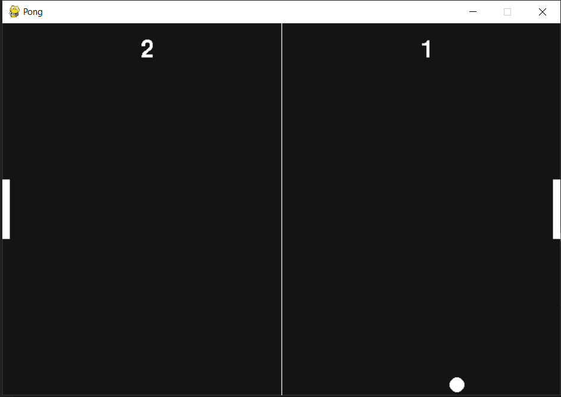

# Pong

## Introduction
A game of Pong written in Python using object oriented design. Use the up and down arrows keys to move the player (left paddle) and 'a' and 'b' keys to move the opponent (right paddle). After either player has won 11 points, the game ends and the appropriate player wins. You can restart the game at that point.

## Usage
1. Download the program zip file.
2. In a windows command prompt or terminal, go to the directory of the program (cd PROJECT_LOCATION)
3. Run the program with the command 'py main.py' Make sure you have python and pygame packages installed.

## Program Output

